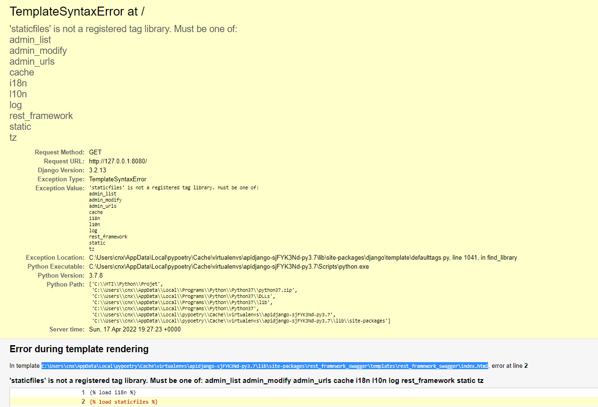
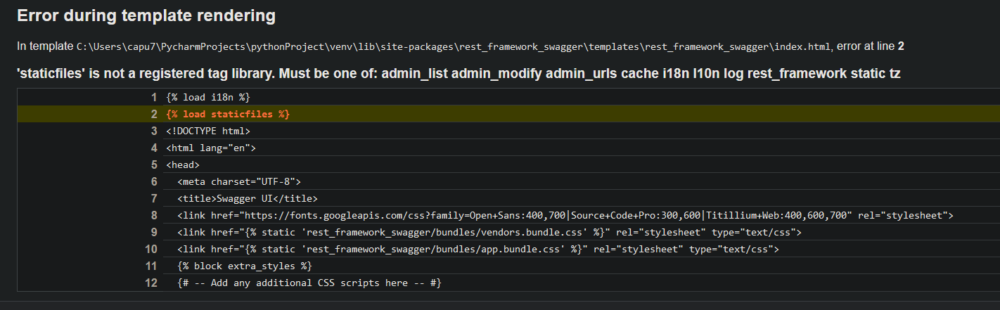
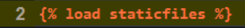
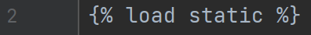

# ApiDjango

L'Api utilise la plateforme **Django**, avec une base de données **sqlite** locale. 

Réalisé par **capucine.fortin** et **ningxi.chen**

_**Python version**_ : Python 3.7

_**Django version**_ : Django 3.2.12

_**Les packages utilisés :**_

- django-rest-framework (version 0.1.0)
- django-rest-swagger (version 2.2.0)

## Afin de lancer le projet, suivre les commandes suivantes
1. ```python manage.py migrate Api```
2. ```python manage.py runserver```

la programme lance sur la porte 80

## La documentation d'API est disponible après voir lancer le programme sur
- http://localhost:80/ 

## Test
 Les tests sont disponibles et à lancer depuis le fichier tests.py

## Problèmes rencontrés et la solution

### En utilisant le package _django-rest-swagger_





### ___Solution___

1. ouvrir ce fichier

2. **à la ligne 2, modifier <staticfiles> en <static>**

 **--->** 
